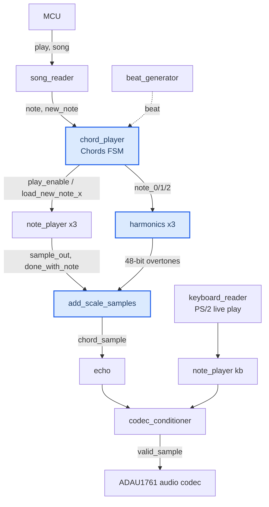

# FPGA Music Player — Digital Design Contributions

A polyphonic, chord-capable music synthesizer built in Verilog for a Xilinx FPGA. This repository collects **my source-code / digital-design contributions** to the final project for **Stanford's EE 108, *Digital System Design***.

The complete project is a hardware synthesizer that reads songs from ROM, plays them as three-note chords with synthesized harmonics, applies an echo effect, drives an audio codec, and renders a live waveform to an HDMI display — with an optional PS/2 keyboard for playing notes by hand. This repo focuses on the RTL modules I designed and the block diagrams I drew for them. It is meant to be read as design work: several supporting modules (the `note_player`, `song_reader`, codec/display infrastructure, and others) are provided by the course framework or shared across the project and are **referenced but not included here**, so the code in this repo does not build standalone. See [What's not included](#whats-not-included) for the full list.

---

## Repository contents

| File | Role |
| --- | --- |
| `chord_player.v` | The **Chords FSM** — turns a stream of notes into stacked, independently-timed three-note chords. |
| `harmonics.v` | Synthesizes the 2nd/3rd/4th **harmonics** of each note for a richer, synth-like timbre. |
| `add_scale_samples.v` | Combinational **mixer** — sums notes and their overtones and normalizes the amplitude to avoid clipping. |
| `music_player.v` | Top-level **datapath** that connects the FSM, note players, harmonics, mixer, echo, and keyboard together. |
| `lab5_top.v` | **Board-level top** — clocking, audio codec, HDMI display, PS/2 keyboard, and rotary-encoder volume. |

The `block_diagrams/` folder contains the hand-drawn design diagrams that accompany these modules:

- `main_block_diagram.jpg` — overall signal flow from the MCU through to the codec.
- `chord_player_fsm.jpg` — full state diagram and I/O table for the Chords FSM.
- `harmonics_block_diagram.jpg` — harmonic-generation datapath and I/O table.
- `add_scale_samples_block_diagram.jpg` — the mixing / normalization logic and I/O table.

---

## System architecture

Audio flows in a single pipeline. The MCU and song reader decide *what* to play, the Chords FSM decides *how notes stack into chords*, the note players and harmonics units generate the raw samples, and the mixer combines and scales them before they reach the codec. A separate PS/2 path lets the user play notes live from a keyboard. The full picture is in `block_diagrams/main_block_diagram.jpg`; the diagram below summarizes the same flow (highlighted blocks are the modules contained in this repo).

### The 16-bit note format

Notes and timing information flow through the pipeline as a single 16-bit word. The fields used by the modules in this repo are:

| Bits | Field | Meaning |
| --- | --- | --- |
| `[15]` | delay-block flag | `0` = a note to place in the current chord; `1` = a *delay block* whose duration sets how long the chord holds. |
| `[14:9]` | note (pitch) | 6-bit semitone index, passed to a note player as `note_to_load`. |
| `[8:3]` | duration | 6-bit duration in beats, passed as `duration_to_load`. |
| `[2:0]` | low bits | carried through the pipeline; defined by the song-ROM / `song_reader` format (not part of this repo). |

This encoding is what makes chords possible: a song is a run of note words (stacked into the chord) followed by a delay block that says "hold this chord for *N* beats."

---

## Module overview

### `chord_player.v` — the Chords FSM

The centerpiece of the project. It wraps the single-voice `note_player` in a finite state machine that turns a serial stream of notes into simultaneous three-note chords, using three parallel note-player slots. See `block_diagrams/chord_player_fsm.jpg` for the full state diagram.

It is a one-hot FSM with six states:

- **`LOAD`** — idle/dispatch. When the song reader offers a new note, the FSM inspects it. A pitch is routed to the first free slot (`LOAD_0`, then `LOAD_1`, then `LOAD_2`); if all three slots are occupied, the note is dropped. A delay block is routed to `SET_DURATION`.
- **`LOAD_0` / `LOAD_1` / `LOAD_2`** — commit the incoming note into the corresponding note-player slot (asserting `load_new_note_x`), then return to `LOAD`.
- **`SET_DURATION`** — one cycle to latch the chord's play length into a counter and to decrement each active note's remaining duration, using the delay block's duration field while it is still valid.
- **`PLAY_CHORD`** — drives `play_enable` to the note players, decrementing the counter on each `beat` while `play` is high, until the count reaches zero and control returns to `LOAD`.

Design touches worth noting: per-note durations are tracked *inside the FSM* (independent of the note players), so notes in a chord can start and end at different times; the FSM's own `note_done` output paces the song reader; and all outputs cleanly reset to zero.

### `harmonics.v` — overtone synthesis

Gives each note a fuller, more instrument-like tone by layering in overtones. For a given fundamental it instantiates three additional note players tuned to the harmonic series:

- **2nd harmonic:** fundamental **+12** semitones (one octave)
- **3rd harmonic:** fundamental **+19** semitones (octave + fifth)
- **4th harmonic:** fundamental **+24** semitones (two octaves)

Each overtone is attenuated with an arithmetic right shift — ×1/2, ×1/4, ×1/8 respectively — giving an exponential roll-off that produces a warm, synth-like sound. If adding an offset would overflow the 6-bit note range, that harmonic falls back to the fundamental to preserve tonal quality. The three scaled overtone samples are concatenated into a single 48-bit output for the mixer. See `block_diagrams/harmonics_block_diagram.jpg`.

### `add_scale_samples.v` — mixing and normalization

Purely combinational logic that assembles the final chord sample and prevents amplitude clipping. See `block_diagrams/add_scale_samples_block_diagram.jpg`. It works in two stages:

1. **Per-note combine** — each note's fundamental is summed with its three harmonics (all signed-shifted to keep headroom) into a single per-note sample.
2. **Chord combine** — the active notes are summed with the correct normalization based on how many are still playing (no divide for one note, ÷2 for two, ÷3 for three). A mux selected by the three `done_with_note` flags picks the right combination, so finished notes drop out of the sum instead of leaking silence or distortion.

`chord_sample_ready` is asserted whenever any note player has a new sample ready.

### `music_player.v` — integration datapath

The module that ties the whole synthesizer together, wiring up the MCU, song reader, Chords FSM, three harmonics units, three note players, the mixer, and the codec conditioner, with pipeline flip-flops inserted to keep the sample path timed correctly. Beyond the core chord engine, it integrates two features:

- **Echo** — a global echo effect on the mixed chord sample for added depth.
- **PS/2 live keyboard** — a keyboard reader and dedicated note player let the user play notes by hand; the codec input is muxed between song playback and the live keyboard so the two never fight over the output.

### `lab5_top.v` — board top level

The synthesizable top for the FPGA. It brings up the clocking (via a clock wizard), the ADAU1761 audio codec (I²S/I²C), the HDMI display pipeline with a live waveform view, the PS/2 keyboard front-end, and a rotary-encoder master-volume control, and instantiates `music_player`. The clocking, codec, and HDMI/display plumbing follow the provided lab framework; the PS/2 enable sequence (sending the `0xF4` "Enable Scanning" command to the keyboard after reset) and the rotary-encoder volume/LED integration are part of the feature work in this project.

---

## What's not included

This repository is a curated subset of the full project — the RTL I authored plus its diagrams. The modules below are referenced by the code but live elsewhere (course-provided starter code, shared project modules, or Xilinx IP), so **the sources here will not synthesize on their own**:

- **Core playback / synthesis:** `note_player`, `song_reader`, `mcu`, `beat_generator`, `codec_conditioner`
- **Effects & I/O used by the integration:** `echo`, `keyboard_reader`, `ps2_ACK_sender`, `rotary_encoder`
- **Board infrastructure (Vivado IP / provided framework):** `adau1761_codec`, `wave_display_top`, `vga_controller_800x480_60`, `hdmi_tx_0`, `clk_wiz_0`
- **Primitives:** `dff`, `dffr`, `button_press_unit`

---

## Course context

Final project for **EE 108 — Digital System Design**, Stanford University. The design was built and validated on a Xilinx FPGA development board (Vivado toolchain) with an ADAU1761 audio codec, HDMI video output, PS/2 keyboard input, and a PMOD rotary encoder. The diagrams in `block_diagrams/` are the design documentation submitted alongside the RTL.

Collaborators

The modules in this repository are my individual contributions, but the full synthesizer was a team effort. Credit for the surrounding work belongs to my teammates:

[Joel Grayson] (@JoelGrayson) — [keyboard piano and wave display]
[Derek Maeshiro] (@derekmaeshiro) — [dynamics, echo, and rotary encoder]

**Author:** Zachary Broveak
